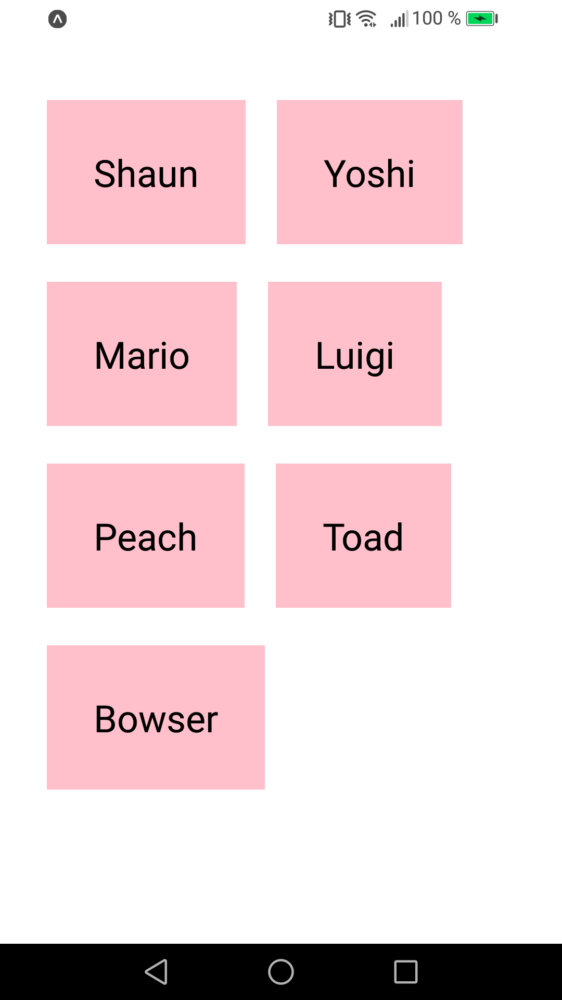

# My First Project

Another quick intro to React Native.

        

## Features

- setting up Expo Go on Android.
- using View, Text and StyleSheet.
- handling state and user inputs with TextInput.
- displaying lists with ScrollView and FlatList.
- deleting items on press with TouchableOpacity.

Based on [React Native Tutorial](https://www.youtube.com/playlist?list=PL4cUxeGkcC9ixPU-QkScoRBVxtPPzVjrQ) by Shaun Pelling - The Net Ninja (2019).
