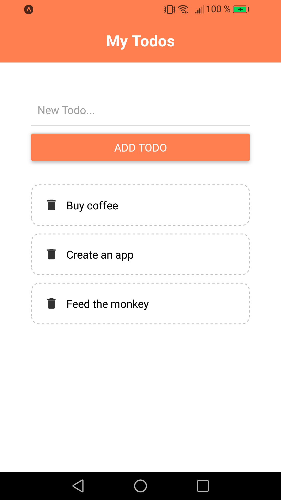

# Todo App

A simple app to work with components.

<!-- 

        

 -->

## Features

- creating components and passing the state with props.
- adding and deleting todos.
- displaying user-friendly messages with Alert.
- dismissing the keyboard.
- using flexbox in React Native.

Based on [React Native Tutorial](https://www.youtube.com/playlist?list=PL4cUxeGkcC9ixPU-QkScoRBVxtPPzVjrQ) by Shaun Pelling - The Net Ninja (2019).
