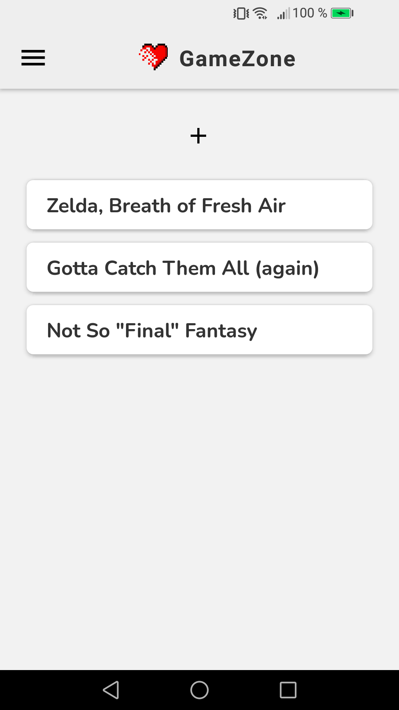

# Game Zone

A reviews app.

<!-- 

        

 -->

## Features

- adding custom fonts with useFonts and AppLoading.
- adding global styles.
- creating a stack navigator with React Navigation 6.
- navigating around and passing data between screens.
- adding a drawer and nesting navigators.
- displaying custom card component, modal and images.

Based on [React Native Tutorial](https://www.youtube.com/playlist?list=PL4cUxeGkcC9ixPU-QkScoRBVxtPPzVjrQ) by Shaun Pelling - The Net Ninja (2019).
